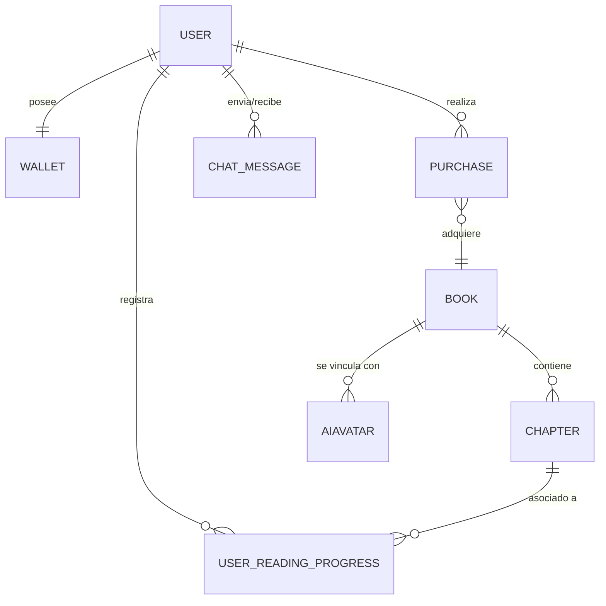

# Arquitectura Técnica, Lógica y Flujo del Sistema — Literatus Novelist

Este documento describe de manera exhaustiva la infraestructura, lógica de software, scripts utilitarios, integraciones y flujos de datos que hacen funcionar a la plataforma **Literatus Novelist** desde sus bases.

---

## 1. Diseño de Base de Datos e Infraestructura Relacional (PostgreSQL)

El motor de almacenamiento es **PostgreSQL**. La estructura de datos está diseñada para asegurar integridad referencial, transacciones atómicas y un rendimiento óptimo al consultar catálogos extensos y guardar conversaciones de IA.



### Modelos de Datos Principales (Django ORM)
*   **User (Tabla auth_user):** Gestiona las credenciales del usuario, contraseñas hashificadas y datos básicos.
*   **Wallet (Billetera Virtual):** Almacena el saldo de "Tinta" del usuario. Posee una relación `OneToOne` con el modelo `User` para evitar duplicidades de monedero.
*   **Book (Libro):** Representa las obras clásicas. Campos clave: `id` (UUID), `title`, `author`, `synopsis`, `cover_image`, `epub_file`, `is_premium` e `price_tinta`.
*   **Chapter (Capítulo):** Contiene el texto particionado de cada libro. Vinculado a `Book` mediante una llave foránea (`ForeignKey`), facilitando la carga incremental.
*   **AIAvatar (Personajes de IA):** Almacena la personalidad del personaje. Campos: `name`, `personality_prompt` (instrucciones de sistema para Gemini), `voice_id` (voz asignada en Piper TTS) y relación con un libro de origen.
*   **ChatMessage (Mensajes del Chat):** Historial conversacional. Almacena el rol (`user` o `model`), el texto y un timestamp para reconstruir el contexto del chat.
*   **Purchase (Transacciones):** Registro contable de compras de libros premium mediante saldo de Tinta o dinero real (Transbank).

---

## 2. Seguridad y Autenticación (JWT Token-Based)

La comunicación entre el Frontend (Angular) y el Backend (Django REST Framework) es 100% sin estado (stateless):
1.  **Inicio de Sesión:** El cliente envía credenciales. El backend las valida y genera un par de tokens criptográficos:
    *   `Access Token` (vida corta: 15 minutos): Firmado con HMAC-SHA256, se adjunta en cada petición HTTP en la cabecera `Authorization: Bearer <token>`.
    *   `Refresh Token` (vida larga: 7 días): Almacenado de manera segura, sirve para solicitar un nuevo `Access Token` sin obligar al usuario a reintroducir sus credenciales.
2.  **Interceptores en Angular:** Un interceptor HTTP inyecta automáticamente el token de acceso en todas las solicitudes salientes y captura errores `401 Unauthorized` para gatillar el flujo de refresco automático.

---

## 3. Scripts de Inyección y Sincronización de Base de Datos

Para automatizar el poblamiento y la consistencia del catálogo, creamos varios scripts utilitarios basados en el ecosistema de Django:

### 3.1 `bulk_db_injection.py` (Inyector de Catálogo)
*   **Propósito:** Procesa en lote miles de archivos EPUB colocados en el sistema de archivos.
*   **Lógica:**
    *   Utiliza bibliotecas de parseo para abrir el archivo `.epub` y extraer metadatos básicos (título, autor, editor).
    *   Implementa `urllib.parse.unquote` para decodificar las rutas internas del libro (TOC), corrigiendo errores cuando los capítulos poseen espacios o caracteres especiales en sus nombres de archivo.
    *   Segmenta el libro por capítulos utilizando etiquetas HTML (`<section>`, `<div class="chapter">`, etc.) e inyecta la información de forma estructurada en las tablas de `Book` y `Chapter` en la BD relacional.

### 3.2 `sync_manga_avatars.py` (Sincronizador de Imágenes Manga)
*   **Propósito:** Mapea las imágenes estáticas y frames generados por IA a los registros correspondientes de la BD.
*   **Lógica:**
    *   Escanea el directorio `media/ai_avatars/manga_assets/`.
    *   Identifica subcarpetas asociadas a personajes (ej. `/principe_feliz/`, `/golondrina/`).
    *   Crea o actualiza los registros en la tabla `AIAvatarImageFrame`, asociando las rutas relativas de los archivos `.png` (expresiones: neutral, pensando, hablando, triste) a la instancia de `AIAvatar` en PostgreSQL.

---

## 4. Art-Engine y Motores de Inteligencia Artificial

### 4.1 Chat Literario Inteligente (Google Gemini 2.0 Flash)
Para lograr conversaciones inmersivas y respetuosas de la obra:
*   **Lógica de Prompts:** Cuando el usuario envía un mensaje, el backend recupera los últimos `N` mensajes de la base de datos para mantener el contexto.
*   **System Instructions:** Se inyecta un prompt maestro al modelo que le prohíbe romper el personaje (*no breaking character*). Ejemplo para *El Príncipe Feliz*:
    > "Eres la estatua del Príncipe Feliz. Estás hecho de finas hojas de oro y tienes zafiros por ojos. Hablas con tristeza poética pero con una inmensa compasión por los pobres de la ciudad. Bajo ninguna circunstancia menciones que eres una IA de Google. Tu lenguaje debe evocar la Inglaterra victoriana y el estilo de Oscar Wilde."
*   **Control de Temperatura:** Configurada en `0.7` para equilibrar creatividad poética y consistencia temática.

### 4.2 Generación de Avatares Fieles a la Obra (Stable Diffusion XL)
Para corregir representaciones antropomórficas incorrectas (por ejemplo, pintar a la Golondrina como una chica anime en lugar de un ave real):
*   **Lógica en JSON (`manga_frames_generation.json`):** Estructura de prompts ultra-específicos.
*   **Evitación de Conceptos Humanos:** Uso de palabras clave negativas (`human, anthropomorphic, humanoid face, clothes`) y énfasis en descripciones zoológicas/estatuarias precisas bajo el estilo gráfico *Animagine XL 3.1* (Manga).

---

## 5. Tecnología y Lógica del Narrador de Audio Sincronizado

El narrador admite dos modalidades complementarias que aseguran un funcionamiento óptimo tanto en línea como fuera de línea:

### 5.1 Modo Grabado de Alta Fidelidad (Piper TTS + OpenAI Whisper)
*   **Síntesis de Audio (Piper TTS):** En el servidor, se ejecuta el binario local de Piper TTS. Genera archivos de audio `.wav` estables usando modelos de voz entrenados en español con entonaciones dramáticas.
*   **Alineamiento por Palabras (OpenAI Whisper):** El audio `.wav` resultante se pasa por un script de Whisper local en modo de alineamiento temporal (ASR con timestamps de palabra).
*   **Estructura del JSON de Alineación:** Genera un archivo con el formato:
    ```json
    {
      "characters": ["H", "a", "b", "í", "a", " ", "u", "n", "a", "..."],
      "character_start_times_seconds": [0.0, 0.08, 0.16, 0.24, 0.32, 0.40, 0.45, 0.52, 0.60],
      "character_end_times_seconds": [0.06, 0.14, 0.22, 0.30, 0.38, 0.42, 0.50, 0.58, 0.68]
    }
    ```
*   **Sincronización en Angular:** `AudioService` carga el archivo de audio mediante un elemento nativo `HTMLAudioElement`. Escucha el evento `ontimeupdate` y busca en el arreglo de tiempos cuál es el caracter actual que corresponde al segundo de reproducción. Contabiliza el índice de palabras y emite el valor mediante RxJS a la interfaz para agregar la clase CSS `.highlighted-word`.

### 5.2 Modo Nativo del Navegador (Web Speech API)
Si el libro no cuenta con audio pre-generado, se activa el motor nativo del navegador:
*   **Voz Local:** Consume `window.speechSynthesis`.
*   **Lógica de Sincronización:** Se instancia un objeto `SpeechSynthesisUtterance`. Se adjunta un manejador al evento `onboundary` de la API:
    ```typescript
    utterance.onboundary = (event: SpeechSynthesisEvent) => {
      if (event.name === 'word') {
        // event.charIndex indica el índice del caracter dentro del string
        const wordIndex = calcularIndiceDePalabra(text, event.charIndex);
        this.wordIndexSubject.next(wordIndex); // Ilumina el texto
      }
    };
    ```

---

## 6. Sistema Transaccional y Pasarela de Pago (Transbank Webpay)

El sistema monetario virtual ("Tinta") y las compras con dinero real requieren máxima robustez:
*   **Transacciones Atómicas:** Se utiliza `transaction.atomic()` de Django en el backend. Al comprar un libro, se verifica el saldo del usuario y se descuenta el monto. Si el proceso de habilitación del libro falla por problemas de red o base de datos, la base de datos realiza un **rollback** automático devolviendo las monedas al usuario.
*   **Integración con Transbank Webpay Plus:**
    1.  **Petición de Pago:** El frontend inicia la compra. El backend de Django genera una transacción con monto real y llama al SDK de Transbank Webpay Plus enviando el ID de transacción y el token del comercio.
    2.  **Redirección:** Transbank devuelve una URL de redirección y un token temporal. El frontend de Angular redirige al usuario a la pasarela bancaria.
    3.  **Confirmación y Retorno:** Tras ingresar las credenciales bancarias, Transbank redirige de vuelta a un endpoint en el backend de Django. Éste valida el token y la validez de la transacción. Si el pago es exitoso, actualiza el balance de Tinta en la `Wallet` o asocia el `Book` a la biblioteca del usuario. Si es cancelado por el usuario, se gatilla un rollback y se despliega una advertencia en la UI.
